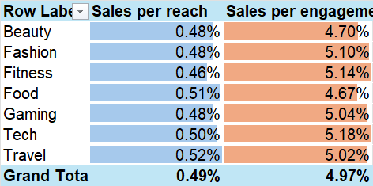
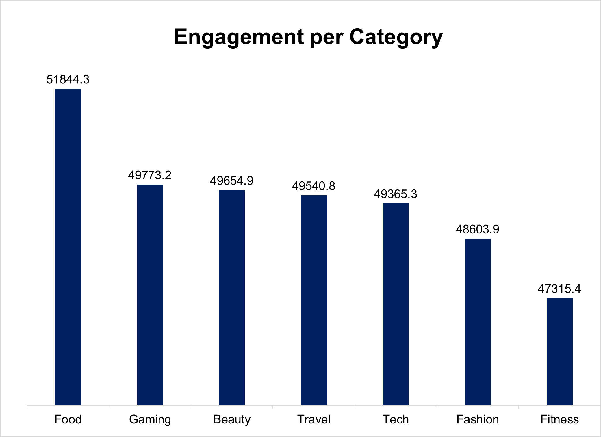
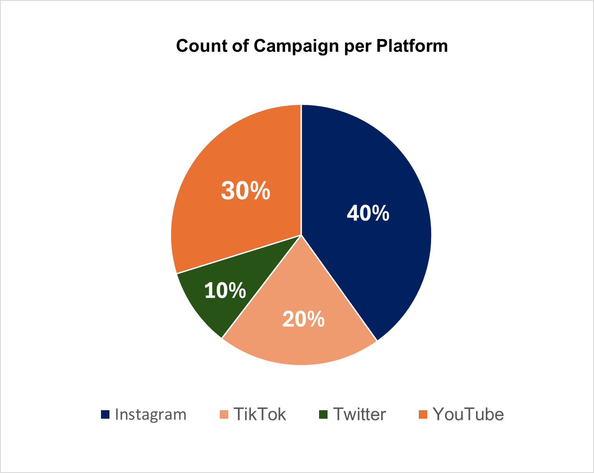
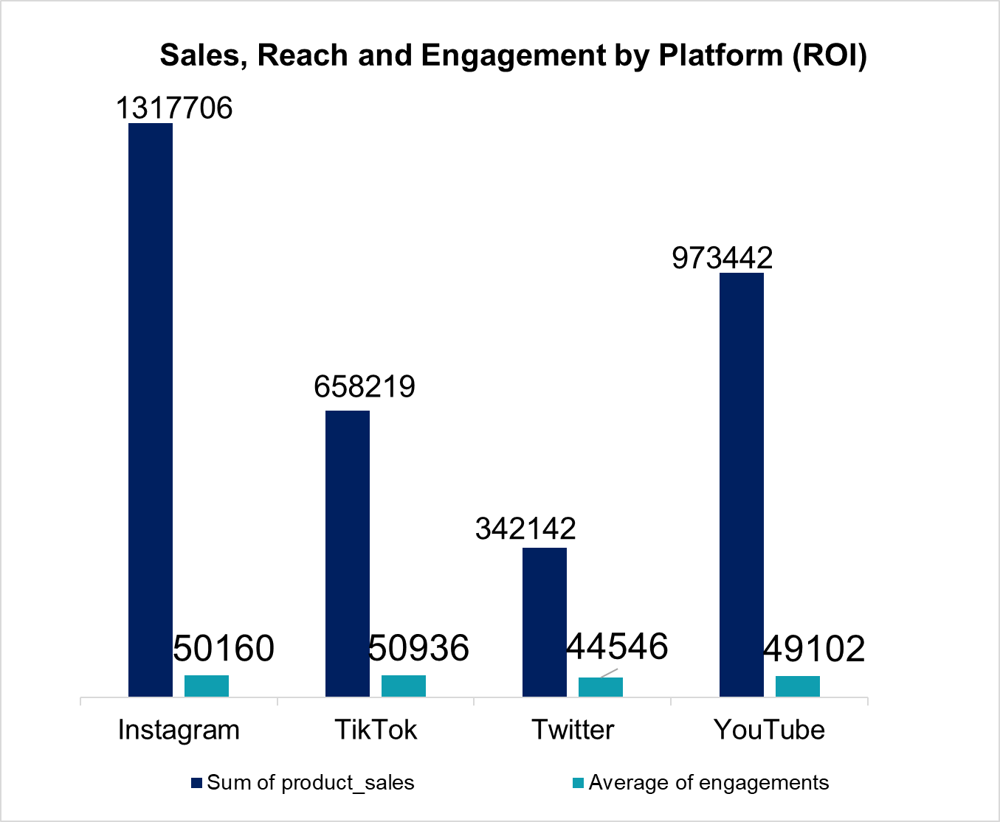
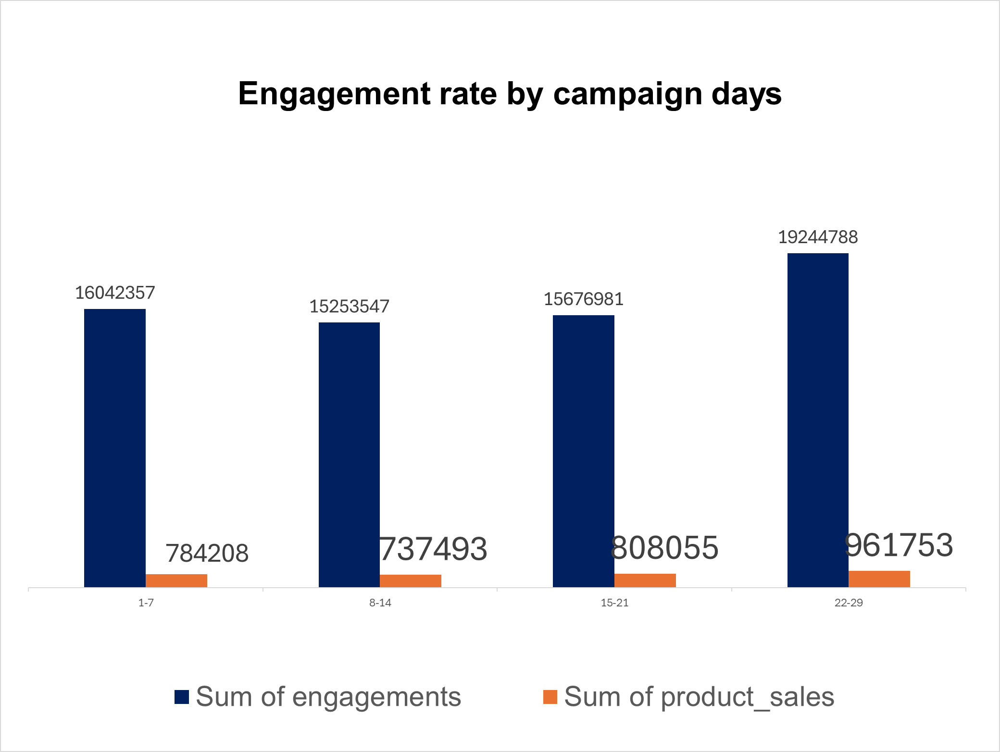

# Excel Project: Influencer Marketing ROI 
## Project Objective
The purpose of this project is to analyze the ROI (Return on Investment) of influencer marketing campaigns and visualize the results in Excel.

## Data Used
Source: [Download Excel Dataset](Influencer_marketing_roi_dataset.xlsx)
- Columns: campaign_id,platform	influencer_category	campaign_type	start_date	engagements	estimated_reach	product_sales	campaign_duration_days	end_date
## Visualizations & Dashboard

### 1. Sales Efficiency by Category
This visualization shows **Sales per Reach** and **Sales per Engagement** for each category.

**KPI Explanation:**

- **Sales per Reach (%)** – measures the percentage of sales generated per audience reach.  
  **Calculation:**  
Sales per Reach (%) = (Total Sales / Total Reach) * 100

- **Sales per Engagement (%)** – measures the percentage of sales generated per user engagement (likes, comments, shares).  
**Calculation:**  
Sales per Engagement (%) = (Total Sales / Total Engagement) * 100
## Result:

 

The analysis of influencer marketing campaigns revealed the following insights:
- **Sales Efficiency by Category:** Highest sales per reach was in Travel (0.52%) and lowest in Fitness (0.46%).  
- **Sales per Engagement:** Tech category performed best (5.18%) while Food was slightly lower (4.67%).  
- **Overall KPI Summary:** Grand Total shows 0.49% sales per reach and 4.97% sales per engagement across all categories.  
### 2. Engagement per Category 
## Result:
 

According to the “Engagement per Category” visualization, the Food category has the highest average engagement (51,844), while Fitness has the lowest (47,315). The overall average engagement across all categories is 49,453.
### 3. Count of Campaign per Platform
## Result:

 

### 4.Sales, Reach and Engagement by Platform (ROI)
## Result:
 

Instagram leads in total sales (1,317,706), TikTok has the highest average engagement (50,936), while Twitter shows the lowest values in both metrics.
### 5.Platform vs Campaign Sales
## Result:
 

Across all platforms, Giveaway campaigns achieved the highest total sales (668,293), followed by Brand Awareness campaigns (714,255). Twitter consistently recorded the lowest sales among platforms for all campaign types.
### 6.Engagement rate by campaign days
## Result:
 

Campaigns lasting 22–29 days achieved the highest engagement (19,244,788) and sales (961,753), indicating that longer campaign durations tend to perform better in both metrics.
### 7.Monthly performance
## Result:
 

Monthly performance shows that July recorded the highest sales (319,732), while October had the lowest (226,114). Sales generally peaked in mid-year and declined toward the end of the year.
### Final Dashboard – Influencer Marketing ROI Overview
## Result: 
The final dashboard provides an overall view of sales, engagement, and campaign performance across all categories and platforms. 
 

## Conclusion and Recommendations
1.For the fitness target audience – Expand reach to a wider audience.   
2.For Food & Beauty – Use short Q&A sessions, polls, and live product demonstrations. Share discount codes in posts.    
3.A balanced test strategy should be implemented across platforms.    
4.For other weaker campaigns:     
5.Stronger Call-to-Action (CTA)       
6.More visual interactivity     
7.During the summer season, run motivational campaigns to increase audience engagement.         
8.Longer advertising duration = higher sales
### End Note
This project summarizes the key insights from influencer marketing data using Excel, highlighting performance patterns and ROI-driven decisions.

   

